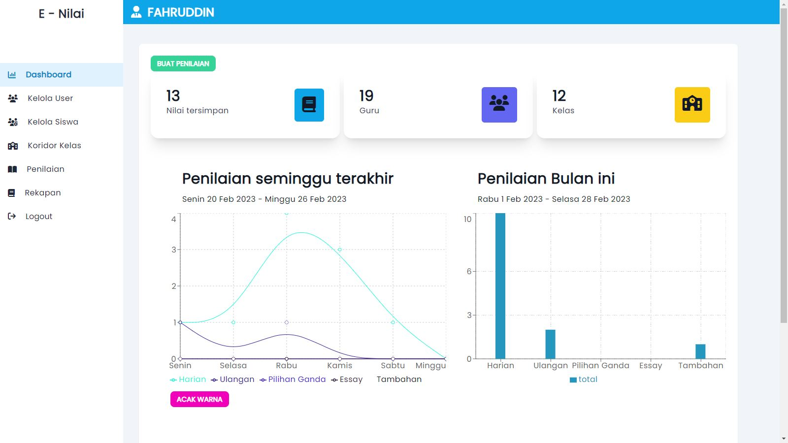

<h1 align="center">E - Nilai</h1>
<p align="center">Kelola, rekap dan unduh penilaian siswa dengan mudah!</p>



<p align="center">


</p>

## Requirements

- php ^8.1
- nodejs ^16.x
- composer ^2.2.0

## Installation

- clone repo ini
- copy .env.example menjadi .env
- jalankan perintah 
    ```sh
    composer install
    #setelah itu
    npm install

    ```
- buat key untuk aplikasi laravel
    ```sh
    php artisan key:generate
    ```
- jangan lupa atur koneksi untuk database di file .env seperti nama host , database dan lain-lain.
- untuk mengetes koneksi ke database jalankan
    ```sh
    php artisan db:monitor
    ```

## Configuration

- atur juga untuk kredensial admin di bagian berikut di dalam file .env
    ```properties
    DEFAULT_ADMIN_USERNAME=nama_user
    DEFAULT_ADMIN_EMAIL=email@gmail.com
    DEFAULT_ADMIN_PASSWORD=rahasia_banget
    ```

### konfigurasi kelas dan jenis pelajaran (opsional)
- buka file database/seeders/DatabaseSeeder.php
- isi value dari tiap kelas atau jenis pelajaran sesuai kebutuhan
- namun secara default kelas dan jenis pelajaran sudah tersedia


## Setting Up table

- setelah semuanya selesai jalankan perintah
    ```sh
    php artisan migrate:fresh --seed
    ```
## Jalankan Aplikasi
- buka dua terminal
- di terminal pertama jalankan 
    ```sh
    php artisan serve
    ```
- dan di terminal berikutnya jalankan 
    ```sh
    npm run dev
    ```
- buka di nama host yang tertera di terminal php
secara default http://localhost:8000 (bisa jadi berbeda)
- silahkan login menggunakan kredensial yang anda masukkan di file .env
- jika semua telah berjalan normal sekarang saatnya melakukan build agar performa aplikasi lebih optimal

## Build
- matikan debug aplikasi dengan mengubah properti pada APP_DEBUG= false di file .env
- lakukan cache untuk aplikasi laravel dengan mengetikkan
    ```sh
    php artisan optimize
    ```
- setelah itu masukkan perintah berikut untuk proses build frontend
    ```sh
    npm run build
    ```

## Run
- setelah semua selesai ketikkan di terminal
    ```sh
    php artisan serve
    ```
- aplikasi anda siap di gunakan !

### silahkan open issue jika terjadi masalah
- fork jika anda ingin berkontribusi bersama kami


<h1 align="center">© KabasaTeam 2023</h1>

